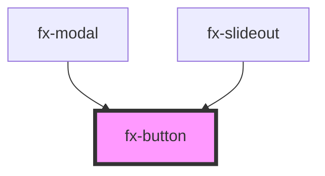

# my-component

<!-- Auto Generated Below -->

## Properties

| Property | Attribute | Description | Type                                   | Default     |
| -------- | --------- | ----------- | -------------------------------------- | ----------- |
| `theme`  | `theme`   |             | `"danger" \| "primary" \| "secondary"` | `undefined` |

## Dependencies

### Used by

 - [fx-modal](../fx-modal)
 - [fx-slideout](../fx-slideout)

### Graph

----------------------------------------------

*Built with [StencilJS](https://stenciljs.com/)*
