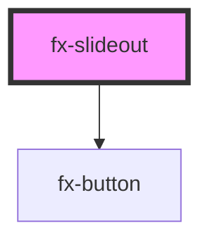

# fx-slideout

<!-- Auto Generated Below -->

## Properties

| Property  | Attribute | Description                                                                                                                                             | Type      | Default     |
| --------- | --------- | ------------------------------------------------------------------------------------------------------------------------------------------------------- | --------- | ----------- |
| `buttons` | `buttons` | An optional list of buttons that can be applied                                                                                                         | `string`  | `undefined` |
| `heading` | `heading` | The title / heading of the slideout. Note that "title" isnt used as a prop name here as "title" is a native html prop which we do not want to overwrite | `string`  | `undefined` |
| `isopen`  | `isopen`  |                                                                                                                                                         | `boolean` | `undefined` |

## Events

| Event    | Description                                                                                                                                                                                                                                 | Type               |
| -------- | ------------------------------------------------------------------------------------------------------------------------------------------------------------------------------------------------------------------------------------------- | ------------------ |
| `action` | This creates a custom event that can be listened to via document.addEventListener  In this example, we have created a new event listener called "action", so we can access this via document.addEventListener('action', customFunctionHere) | `CustomEvent<any>` |

## Dependencies

### Depends on

- [fx-button](../fx-button)

### Graph

----------------------------------------------

*Built with [StencilJS](https://stenciljs.com/)*
